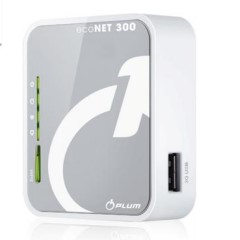
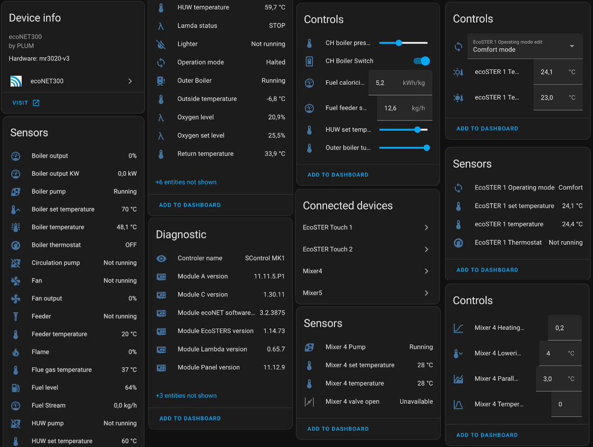

# ecoNET300 Home Assistant integration

[](https://github.com/astral-sh/ruff)
[](https://github.com/hacs/integration)
[](https://github.com/jontofront/ecoNET-300-Home-Assistant-Integration/actions/workflows/hacs.yml)
[](https://guidelines.denpa.pro/stability#alpha)
[](https://github.com/jontofront/ecoNET-300-Home-Assistant-Integration/actions/workflows/hassfest.yaml)

<div align="center">

| Home Assistant  | ecoNET300     | device        |
| --------------- | ------------- | ------------- |
|                 |               |  |

</div>


## Overview
ecoNET300 Home Assistant is a custom integration for ecoNET300 devices. 

It works locally, which means it connects directly to your local device using local IP address. It doesn't forward commands/requests through econet24.com. It uses rest api exposed by ecoNET300 device.

This integration is available from the Lovelace frontend without the need to configure the devices in the file configuration.yaml

Integration tested with ecoMAX controller ecoMAX810P-L TOUCH manufactured by [Plum Sp. z o.o.](https://www.plum.pl/)

**Bear in mind that the project is in a very early, pre-alpha phase.**

## versions
* v0.3.3 - version is stable. Most of the work was done by @pblxpt, for which we're very thankful as the community.
* v1.0.0_beta - is a new dev integration version that fetches more data from API, I don't know yet if it will be better or worse :). It's my first work.


## Example
Here is an example setup showing econet300 device entities:

<div align="center">


             

</div>

## HACS Installation ##
Follow [this guide](https://hacs.xyz/docs/faq/custom_repositories/) to add ecoNET-300-Home-Assistant-Integration as a custom repository to the HACS.
Use this url as a repo: 
```
https://github.com/jontofront/ecoNET-300-Home-Assistant-Integration
```

## Manual Installation
Copy the  `custom_components` folder your configuration directory.
It should look similar to this:
```
<config directory>/
|-- custom_components/
|   |-- econet300/
|       |-- [...]
```

## Configuration

Adding ecoNET300 integration to your Home Assistant instance can be done via user interface, by using this My button:


[](https://my.home-assistant.io/redirect/config_flow_start?domain=econet300)
<details>
  <summary><b>Manual Configuration Steps</b></summary>
  
Apart from using 'My button' (in case it doesn't work) you can also perform the following steps manually:

1. Browse to your Home Assistant instance.
2. In the sidebar click on Settings.
3. From the configuration menu select: Devices & Services.
4. In the bottom right, click on the Add Integration button.
5. From the list, search and select "ecoNET300".


6. Enter your connection details and click `Submit`.  

__Host__: Local IP/domain of your device.  

__Username__: Local username (NOT the username that you use to login to econet24.com!).

__Password__: Local password (NOT the password that you use to login to econet24.com!).


7. Your device should now be available in your Home Assistant installation.


  
</details>
<br>

## Entities
### Sensors
- Fan power (fanPower)
- Feeder temperature (tempFeeder)
- Exhaust (tempFlueGas)
- Fireplace temperature (tempCO)
- Fireplace set temperature (tempCOSet)
- Feeder temperature (tempFeeder)
- Water back temperature (tempBack)
- Water temperature (tempCWU)
- Outside temperature (tempExternalSensor)
- Fuel level (fuelLevel)
- Mixer 1 set temperature (mixerSetTemp1)
- Oxygen set level (lambdaSet)
- Oxygen level (lambdaLevel)

### Binary sensors
- Water pump (pumpCWUWorks)
- Fireplace pump (pumpFireplaceWorks)
- Circulation pump (pumpCirculationWorks)
- Solar pump (pumpSolarWorks)
- Fireplace pump (pumpCOWorks)
- Lighter (lighterWorks)
- Fan (fanWorks)
- Feeder (fanWorks)

## Contributing

This is HA integration open-source project. We are always open to people who want to use the code or contribute to it.


### Contributors
Many thanks to @denpamusic for his help and pointing me in the right direction

<a href="https://github.com/jontofront/ecoNET-300-Home-Assistant-Integration/graphs/contributors">
  
</a>

---
## DISCLAIMER
**I AM NOT RESPONSIBLE FOR ANY USE OR DAMAGE THIS SOFTWARE MAY CAUSE. THIS IS INTENDED FOR EDUCATIONAL PURPOSES ONLY. USE AT YOUR OWN RISK.**
